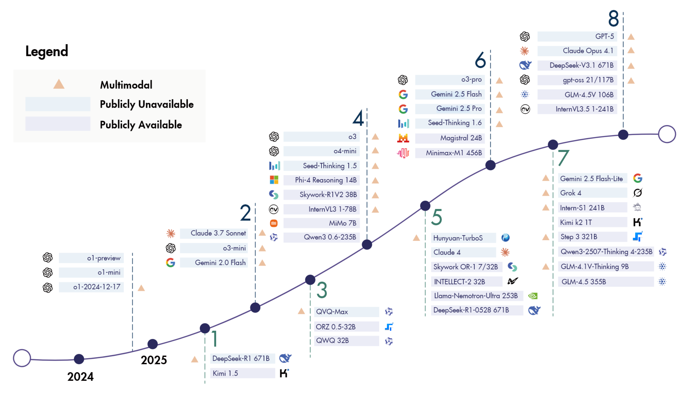

  
*Image source: [A Survey of Reinforcement Learning for Large Reasoning Models](https://arxiv.org/abs/2509.08827)*

# LLM Model Updates Tracker (Keep Updating~)

A tracker for the latest updates on Large Language Models from various companies.

<!-- LAST_UPDATED_START -->
*Last updated: 2025-10-13*
<!-- LAST_UPDATED_END -->

<!-- TABLE_START -->
| Company      | Model Version                      | Update Date | Improvements & Features                                      |
| :----------- | :--------------------------------- | :---------- | :----------------------------------------------------------- |
| OpenAI | Sora2 | 2025-10-01 | Sora2 正式发布, 用于生成短视频。 |
| Anthropic<br/>[](https://www.anthropic.com/news/claude-sonnet-4-5) | Claude-4.5-Sonnet | 2025-09-30 | Claude Sonnet 4.5 is the best coding model in the world. It's the strongest model for building complex agents. It’s the best model at using computers. And it shows substantial gains in reasoning and math. |
| ZhipuAI | GLM-4.6 | 2025-09-30 | 前脚DeepSeek更新到了V3.2，现在智谱又更新了——正式推出GLM-4.6，代码能力直接推到了国内最强。 |
| DeepSeek<br/>[](https://github.com/deepseek-ai/DeepSeek-V3.2-Exp/blob/main/DeepSeek_V3_2.pdf) | DeepSeek-V3.2-Exp | 2025-09-29 | 假期前一天，熟悉的节奏。 |
| Alibaba<br/>[](https://qwen.ai/research) | Qwen3-VL-235B-A22B，Qwen3-Coder-Plus，Qwen3-LiveTranslate-Flash，Qwen3-Max，Qwen3Guard，Qwen3-Omni，Qwen3-Image-Edit，... | 2025-09-24 | Qwen3全家桶发布。 |
| Deepseek<br/>[](https://huggingface.co/deepseek-ai/DeepSeek-V3.1-Terminus) | DeepSeek-V3.1-Terminus | 2025-09-22 | 深度求索（DeepSeek）刚刚发布了一个新模型：DeepSeek-V3.1-Terminus。本次升级基于 DeepSeek-V3.1，并做出了两项重大改进：1.语言一致性：缓解了中英文混杂、偶发异常字符等情况；比如之前的「极」字现象。 2.Agent 能力：进一步优化了 Code Agent 与 Search Agent 的表现。 |
| Alibaba<br/>[](https://tongyi-agent.github.io/blog/introducing-tongyi-deep-research/) | Tongyi-DeepResearch | 2025-09-16 | 我们自豪地推出通义 DeepResearch——首个性能全面对标 OpenAI DeepResearch 的开源 Web 智能体。在各项综合性基准测试中，通义 DeepResearch 展现出sota水平。 |
| Tencent<br/>[](https://hunyuan-promptenhancer.github.io/) |  PromptEnhancer-32B, PromptEnhancer-7B | 2025-09-16 | Hunyuan-PromptEnhancer is a prompt rewriting utility. It restructures an input prompt while preserving the original intent, producing clearer, layered, and logically consistent prompts suitable for downstream image generation or similar tasks. |
| OpenAI | GPT-5-Codex | 2025-09-16 | GPT-5-Codex 重点优化了在真实工程场景中的自主式（agentic）软件工程能力。它既能在短时间的交互式会话中快速响应，也能独立完成冗长复杂的任务。它的代码审查（code review）能力可以在代码上线前发现关键漏洞。 |
| ByteDance | Seed-OSS-36B-Base, Seed-OSS-36B-Base2, Seed-OSS-36B-Instruct | 2025-08-21 | 开源 |
| Deepseek | deepseek-V3.1, deepseek-V3.1-Base | 2025-08-19 | DeepSeek-V3.1 是一种混合模型，支持思考模式和非思考模式。与上一版本相比，此次升级在多个方面带来了改进：1.混合思考模式：通过改变聊天模板，一个模型即可支持思考模式和非思考模式。2.更智能的工具调用：通过后训练优化，模型在工具使用和代理任务方面的性能显著提升。3.更高的思考效率：DeepSeek-V3.1-Think 实现了与 DeepSeek-R1-0528 相当的答案质量，同时响应速度更快。DeepSeek-V3.1 在 DeepSeek-V3.1-Base 的基础上进行了后训练，DeepSeek-V3.1-Base 是基于原始 V3 基础检查点，通过两阶段长上下文扩展方法构建的，遵循了原始 DeepSeek-V3 报告中概述的方法。 |
| ZhipuAI | GLM-4.5V | 2025-08-11 | GLM-4.5V 是智谱新一代基于 MOE 架构的视觉推理模型，以106B的总参数量和12B激活参数量，在各类基准测试中达到全球同级别开源多模态模型 SOTA，涵盖图像、视频、文档理解及 GUI 任务等常见任务。 |
| OpenAI | gpt-5, gpt-5-pro | 2025-08-08 | GPT-5 是一个一体化系统，包含三个核心部分：一个智能高效的基础模型，可解答大多数问题；一个深度推理模型（即GPT-5思维模块），用于处理更复杂的难题；以及一个实时路由模块，能够基于对话类型、问题复杂度、工具需求及用户显式指令（如prompt含“仔细思考这个问题”）智能调度模型。 |
| OpenAI | gpt-oss-120b, gpt-oss-20b | 2025-08-05 | Open-weight reasoning models (Apache 2.0 license). gpt-oss-120b (117B params) and gpt-oss-20b (21B params). |
| Anthropic | Claude Opus 4.1 | 2025-08-05 | Drop-in replacement for Opus 4, with hybrid reasoning and extended thinking. |
| Google DeepMind | Genie 3 | 2025-08-05 | Foundation world model that generates real-time interactive 3D environments from text prompts. Research preview. |
| ZhipuAI | GLM-4.5, GLM-4.5-Air | 2025-07-28 | 混合推理模型，提供：用于复杂推理和工具使用的思考模式，以及用于即时响应的非思考模式。 |
| Alibaba | Qwen3-Coder(480B-A35B-Instruct...) | 2025-07-23 |  |
| Alibaba | Qwen3-235B-A22B-2507 | 2025-07-22 |  |
| Moonshot | Kimi-K2 | 2025-07-12 |  |
| xAI | grok4, grok4-heavy | 2025-07-10 |  |
| Moonshot | Kimi-Research | 2025-06-20 |  |
| Google | gemini-2.5-flash-lite-preview-06-05 | 2025-06-18 |  |
| Moonshot | Kimi-Dev-72B | 2025-06-17 | 支持全球最长的上下文窗口，包括 100 万 tokens 输入、8 万 tokens 输出。 A Strong and Open-source Coding LLM for Issue Resolution |
| MiniMax | MiniMax-M1-80k/40k | 2025-06-11 |  |
| Google | gemini-2.5-pro-preview-06-05 | 2025-06-05 |  |
| Deepseek | deepseek-r1-0528 | 2025-05-28 |  |
| Google | gemini-2.5-flash-preview-05-20 | 2025-05-20 |  |
| Anthropic | claude-opus/sonnet-4-20250514 | 2025-05-14 |  |
| Google | gemini-2.5-pro-preview-05-06 | 2025-05-06 |  |
| Alibaba | Qwen3-235B-A22B | 2025-04-29 |  |
| OpenAI | o3-2025-04-16 | 2025-04-16 |  |
| OpenAI | chatgpt-4o-latest-20250326 | 2025-03-26 |  |

<!-- TABLE_END -->

## 🌟 Features

*   **Automatic Updates**: Automatically fetches the latest LLM updates from multiple sources daily via GitHub Actions.
*   **Structured Data**: All model information is stored in an easy-to-parse `scripts/data.json` file.
*   **Community-Driven**: Anyone is welcome to contribute new model information or improve the project.
*   **Clear Overview**: The table in the README provides an at-a-glance view of model release dynamics from major companies.

## ✍️ How to Contribute

We warmly welcome community contributions! You can participate in the following ways:

### 1. Add or Update Model Information

All model data is stored in the `scripts/data.json` file. If you find a new model release or incorrect information, please:

1.  **Fork this repository**
2.  **Modify `scripts/data.json`**: Add or update the corresponding model entry. Please ensure the JSON format is correct.
3.  **(Optional) Update the README**: Run the following command locally to update the table in the README.
    ```bash
    python scripts/update_readme.py
    ```
4.  **Submit a Pull Request**: We will review your contribution as soon as possible.

### 2. Add New Information Sources

Our automatic update script, `scripts/fetch_updates.py`, retrieves information via RSS feeds. If you have good information sources to recommend, you can:

*   Directly modify the `RSS_FEEDS` list in `scripts/fetch_updates.py` and submit a Pull Request.
*   Or, create an [Issue](https://github.com/your-username/your-repository/issues) and tell us the new RSS feed URL.

### 3. Report Issues or Suggest Improvements

If you encounter any problems or have any suggestions for improvement, feel free to submit an [Issue](https://github.com/your-username/your-repository/issues).

## 🤖 Automation

This repository uses GitHub Actions for automated updates.

This repository uses GitHub Actions for automated updates, managed by two separate workflows:

- `.github/workflows/fetch_data.yml`: Periodically fetches the latest model data by running `scripts/fetch_updates.py` and updates `scripts/data.json`.
- `.github/workflows/update_readme.yml`: Periodically updates the `README.md` table by running `scripts/update_readme.py` and creates a pull request with the changes.

## 📄 License

This project is open-sourced under the [MIT License](LICENSE).

