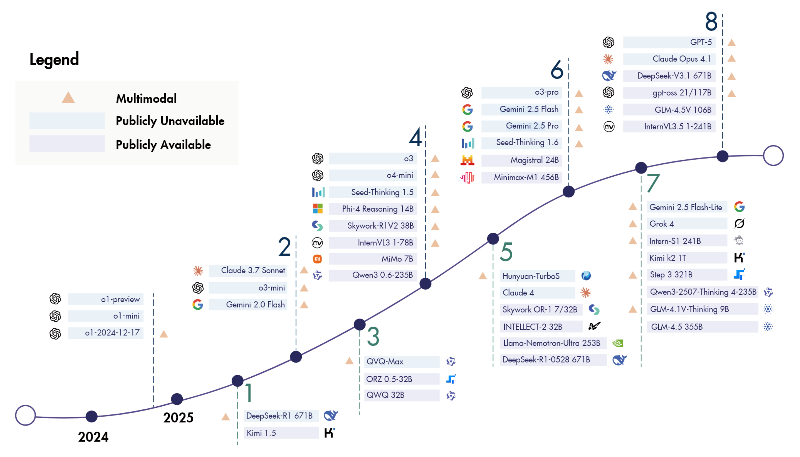

  
*Image source: [A Survey of Reinforcement Learning for Large Reasoning Models](https://arxiv.org/abs/2509.08827)*

# LLM Model Tracker (Keep Updating~)

> [!TIP]
> **网页版已上线！** 访问更美观的在线时间轴：[https://tinderz.github.io/LLM-Tracker/](https://tinderz.github.io/LLM-Tracker/)

A tracker for the latest updates on Large Language Models from various companies.

<!-- LAST_UPDATED_START -->
*Last updated: 2026-05-09*
<!-- LAST_UPDATED_END -->

<!-- TABLE_START -->
| Company      | Model Version                      | Update Date | Improvements & Features                                      |
| :----------- | :--------------------------------- | :---------- | :----------------------------------------------------------- |
| ZhipuAI<br/>[](https://finance.eastmoney.com/a/202603163672888826.html) | GLM-5-Turbo | 2026-03-16 | 面向 OpenClaw（龙虾/Agent）场景深度优化的基座模型；从训练阶段就针对龙虾任务核心需求专项优化，增强工具调用、指令遵循、定时与持续性任务、长链路执行等能力；在自研基准 ZClawBench 中取得国产模型第一；同步推出龙虾套餐（个人版 39 元/月起）和企业级安全管理体系。 |
| Mistral<br/>[](https://docs.mistral.ai/getting-started/changelog/) | Mistral Small 4 | 2026-03-16 | 119B 参数 MoE 模型（128 专家，每 token 激活 4 个专家/6B 参数），首次将指令遵循（Mistral Small）、推理（Magistral）、多模态（Pixtral）和编码（Devstral）统一到单一模型中；256K 上下文窗口；支持推理深度可配参数（reasoning_effort）；端到端完成时间降低 40%，吞吐量提高 3 倍。 |
| NVIDIA<br/>[](https://blogs.nvidia.com/blog/nemotron-3-super-agentic-ai/) | Nemotron 3 Super | 2026-03-11 | 120B 总参数（12B 激活）的开源混合 Mamba-Transformer MoE 模型，面向 Agentic AI；1M token 上下文窗口；吞吐量比前代提升 5 倍，精度提升 2 倍；支持多 token 预测（MTP）实现 3 倍推理加速；在 Blackwell GPU 上以 NVFP4 精度运行，比 Hopper FP8 快 4 倍。完全开源（权重、数据集和训练配方）。 |
| Google<br/>[](https://blog.google/innovation-and-ai/technology/developers-tools/gemini-embedding-2/) | Gemini Embedding 2 | 2026-03-10 | Google 首个原生多模态嵌入模型，可将文本、图像、视频、音频和文档映射到统一的嵌入空间；文本输入上限 8192 token（4 倍于前代）；生成 3072 维向量，支持 Matryoshka 表示学习灵活压缩维度；支持 100+ 语言；通过 Gemini API 和 Vertex AI 以公开预览提供。 |
| xAI<br/>[](https://docs.x.ai/docs/release-notes) | Grok 4.20 Beta Non-Reasoning (Stable) | 2026-03-09 | Grok 4.20 系列的速度优先变体，正式进入稳定 Beta 阶段；不使用思维链推理直接生成回答，输出速度达 232.5 tokens/s；2M token 上下文窗口；支持文本和图像输入；在同价位非推理模型中 AI 分析指数得分排名领先。 |

<!-- TABLE_END -->

## 🌟 Features

*   **Intelligent AI Fetching**: Automatically searches and extracts the latest LLM updates daily using LLM (OpenAI/Perplexity) + Web Search.
*   **Web Dashboard**: A beautiful, interactive timeline to explore model updates with filtering and language support.
*   **Structured Data**: All model information is stored in a clean `docs/data.json` file.
*   **Automation**: Managed entirely by GitHub Actions for zero-maintenance updates.

## ✍️ How to Contribute

We warmly welcome community contributions! You can participate in the following ways:

### 1. Add or Update Model Information

All model data is stored in the `docs/data.json` file. If you find a new model release or incorrect information, please:

1.  **Fork this repository**
2.  **Modify `docs/data.json`**: Add or update the corresponding model entry. Please ensure the JSON format is correct.
3.  **(Optional) Update the README**: Run the following command locally to update the table in the README.
    ```bash
    python scripts/update_readme.py
    ```
4.  **Submit a Pull Request**: We will review your contribution as soon as possible.

### 2. Report Issues or Suggest Improvements

If you encounter any problems or have any suggestions for improvement, feel free to submit an [Issue](https://github.com/TinderZ/LLM-Model-Updates-Tracker/issues).

## 🤖 Automation

This repository uses GitHub Actions for automated updates, managed by two separate workflows:

- `.github/workflows/fetch_data.yml`: Periodically searches for the latest model data using AI and updates `docs/data.json`.
- `.github/workflows/update_readme.yml`: Periodically updates the `README.md` table to show the latest entries.


## 📄 License

This project is open-sourced under the [MIT License](LICENSE).

